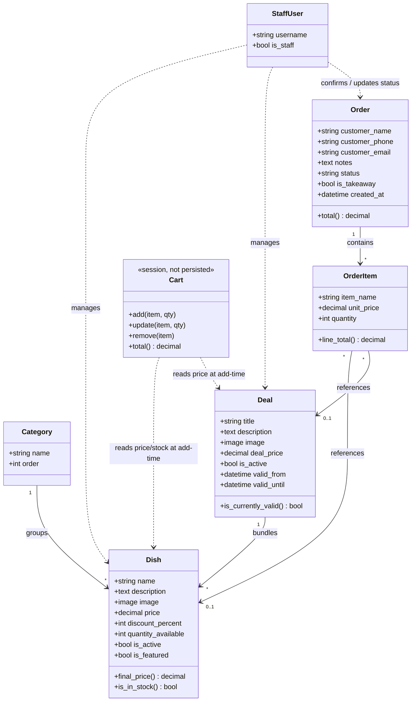
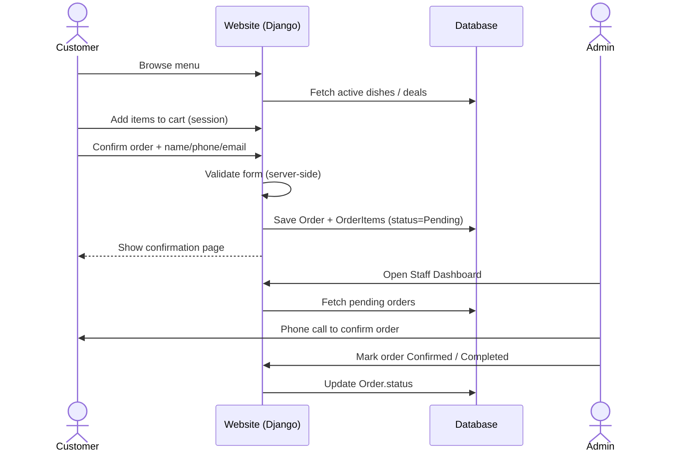

# Analysis / Domain Class Diagram — Mandi 1 Restaurant Website

```mermaid
classDiagram
    class Category {
        +string name
        +int order
    }

    class Dish {
        +string name
        +text description
        +image image
        +decimal price
        +int discount_percent
        +int quantity_available
        +bool is_active
        +bool is_featured
        +final_price() decimal
        +is_in_stock() bool
    }

    class Deal {
        +string title
        +text description
        +image image
        +decimal deal_price
        +bool is_active
        +datetime valid_from
        +datetime valid_until
        +is_currently_valid() bool
    }

    class Order {
        +string customer_name
        +string customer_phone
        +string customer_email
        +text notes
        +string status
        +bool is_takeaway
        +datetime created_at
        +total() decimal
    }

    class OrderItem {
        +string item_name
        +decimal unit_price
        +int quantity
        +line_total() decimal
    }

    class Cart {
        <<session, not persisted>>
        +add(item, qty)
        +update(item, qty)
        +remove(item)
        +total() decimal
    }

    class StaffUser {
        +string username
        +bool is_staff
    }

    Category "1" --> "*" Dish : groups
    Deal "1" --> "*" Dish : bundles
    Order "1" --> "*" OrderItem : contains
    OrderItem "*" --> "0..1" Dish : references
    OrderItem "*" --> "0..1" Deal : references
    Cart ..> Dish : reads price/stock at add-time
    Cart ..> Deal : reads price at add-time
    StaffUser ..> Dish : manages
    StaffUser ..> Deal : manages
    StaffUser ..> Order : confirms / updates status
```

## Data flow analysis (order lifecycle)

```mermaid
sequenceDiagram
    actor C as Customer
    participant W as Website (Django)
    participant DB as Database
    actor A as Admin

    C->>W: Browse menu
    W->>DB: Fetch active dishes / deals
    C->>W: Add items to cart (session)
    C->>W: Confirm order + name/phone/email
    W->>W: Validate form (server-side)
    W->>DB: Save Order + OrderItems (status=Pending)
    W-->>C: Show confirmation page
    A->>W: Open Staff Dashboard
    W->>DB: Fetch pending orders
    A->>C: Phone call to confirm order
    A->>W: Mark order Confirmed / Completed
    W->>DB: Update Order.status
```
